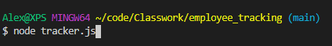
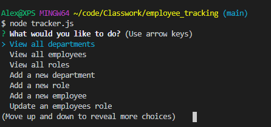
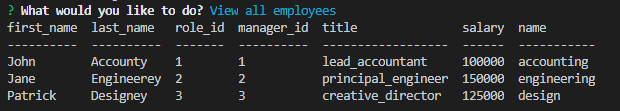

# employee_tracking

## Authors: 
Alex Milroy  

## Table of contents:
* [Files](#Files)
* [Description](#Description)
* [Installation](#Installation)
* [Uses](#Uses)
* [License](#License)
* [Contributions](#Contributions)
* [Tests](#Tests)
* [Contact](#Contact)

## Files

## Description
The employee tracker is a small application that uses inquirer and a SQL database to track and update employee information in a business setting. There is a single SQL database with 3 tables that store information about departments, roles, and employees. Using inquirer, users can see the information saved in the multiple tables displayed to them in formats that join data from the different tables. The user can read multiple types of data, and also change or add new data if they wish.

Video of the application can be seen here: https://drive.google.com/file/d/1QA94PP2XS-3ckWB4lg7x2ejVUYgeXOjU/view

## Installation
To run this applications, users must install all required NPM packages, and run the node application from a command prompt by typing" node tracker.js" to initialize the program.

## Uses
This application runs in a terminal window. To install this application, users must install the required NPM packages inquirer, mysql, and console.table. Users must also substantiate the databases in MySQL workbench. You can then run the application by opening a new terminal window, and typing “node tracker.js” to start the application.

## License
This application is goverened by the MIT license.

## Contributions
Yes

## Tests
Users can test if the application is working by running the application following the uses above. If you see a inquirer window pop up after you run tracker.js then the application is running correctly.
    
## Contact:
github.com/ajm5099
amilroy@gmail.com

